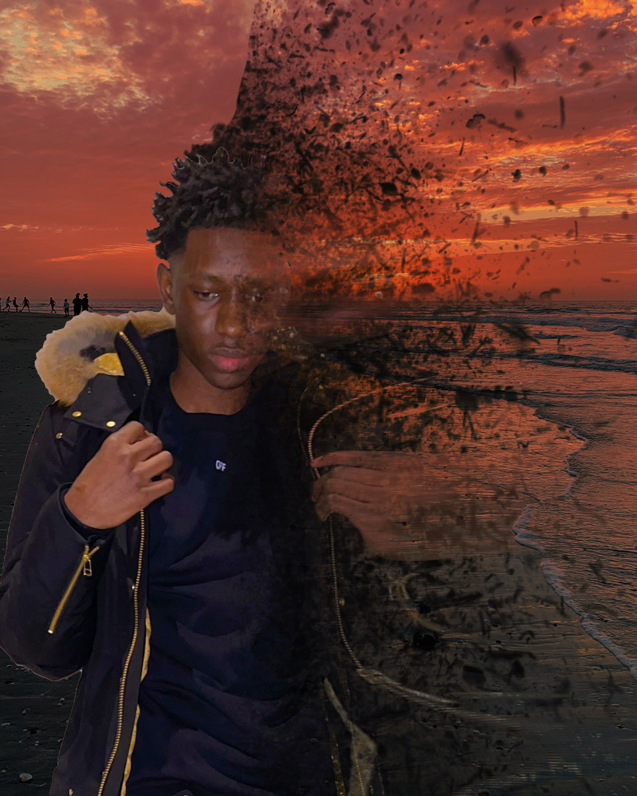
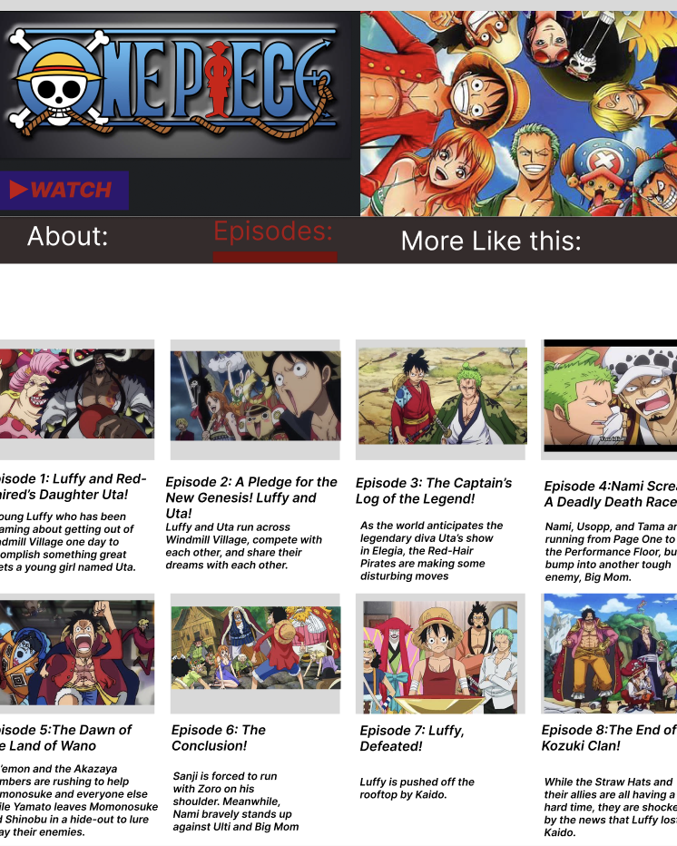

<!-- CONTENT WRAPPER -->
    

        <!-- HOME --><section id="home" class="full-height px-lg-5">
            

                

                    

                        <h1 class="display-4 fw-bold" data-aos="fade-up">I'M A UI/UX & Web
                                DESIGNER</h1>
                        
I am Abdul Touray, And I craft
                            high-performing and delightful experiences tailored and conversion-focused

                        

                            <a href="#work" class="btn btn-brand me-3">Explore My Work</a>
                        

                    

                

            

        </section><!-- //HOME -->
        <!-- ABOUT --><section id="about" class="full-height px-lg-5">
            

                

                    

                        <h6 class="text-brand">ABOUT</h6>
                        <h1>About Me</h1>
                    

                

                

                    

                        

                            

                                

                                    <h4>Web Designer</h4>
                                    
Hey there, my name is Abdule Touray, I am a student currently studying multimedia programming and design. My focus is on web design and UX/UI, and I'm really dedicated to mastering these skills. I believe that creating visually appealing and intuitive interfaces is key to delivering great user experiences, whether it's on websites, apps, or other digital products. I'm always striving to learn more and improve my craft, and I'm excited to see where my passion for design and technology will take me. Overall, I'd say I'm a creative and imaginative person with a drive to succeed, and I'm confident that I'll make a real impact in the world of web design.

                                

                            

                            

                                

                                  
                                

                            

                        

                    

                

            

        </section><!-- ABOUT -->
        <!-- SERVICES --><section id="services" class="full-height px-lg-5">
            

                

                    

                        <h6 class="text-brand">SERVICES</h6>
                        <h1>Services That I Provide</h1>
                    

                

                

                    

                        

                            

                                <i class="las la-feather"></i>
                            

                            <h5 class="mt-4 mb-2">UX Design</h5>
                            
As a user experience designer, I focus on creating intuitive and user-friendly designs that enhance the overall experience for the end-user. I take into consideration the needs and goals of the user, as well as the business requirements, to create designs that are both effective and enjoyable to use.

                        

                    

                    

                        

                            

                                <i class="las la-pencil-ruler"></i>
                            

                            <h5 class="mt-4 mb-2">Gracphic Design</h5>
                            
As a graphic designer, I have a passion for visual communication and the ability to bring ideas to life through design. I use my expertise in color, typography, composition, and branding to create eye-catching graphics that effectively communicate a message and leave a lasting impression.

                        

                    

                    

                        

                            

                                <i class="las la-laptop-code"></i>
                            

                            <h5 class="mt-4 mb-2">Web Designing</h5>
                            
As a web designer, understaning the importance of creating visually appealing and functional websites that accurately reflect a company's brand and message. Applying my knowledge of design principles, user experience, and technology to craft websites that meet the needs of businesses and their target audience.

                        

                    

                

            

        </section><!-- SERVICES -->
        <!-- WORK --><section id="work" class="full-height px-lg-5">
            

                

                    

                        <h6 class="text-brand">WORK</h6>
                        <h1>My Projects</h1>
                    

                

                

                    

                        

                            

                                
                            

                            

                                <h4>Flyer and Poster Design</h4>
                                
Innovation that exceeds expectations. Astra is a true template equiqed with all the elements you could ever need to put together

                                <a href="#" class="link-custom">Read More</a>
                            

                        

                    

                    

                        

                            

                                
                            

                            

                                <h4>Anime Mockup App Editing with Figma</h4>
                                
Innovation that exceeds expectations. Astra is a true template equiqed with all the elements you could ever need to put together

                                <a href="#" class="link-custom">Read More</a>
                            

                        

                    

                    

                        

                            

                                
                            

                            

                                <h4>Landscape Photo Editing with Illustrator</h4>
                                
Innovation that exceeds expectations. Astra is a true template equiqed with all the elements you could ever need to put together

                                <a href="#" class="link-custom">Read More</a>
                            

                        

                    

                    

                        

                            

                                
                            

                            

                                <h4>Cityscape Photo Editing with Illustrator</h4>
                                
Innovation that exceeds expectations. Astra is a true template equiqed with all the elements you could ever need to put together

                                <a href="#" class="link-custom">Read More</a>
                            

                        

                    

                    

                        

                            

                                
                            

                            

                                <h4>CUNY Art Website Mockup Editing with Figma</h4>
                                
Innovation that exceeds expectations. Astra is a true template equiqed with all the elements you could ever need to put together

                                <a href="#" class="link-custom">Read More</a>
                            

                        

                    

                    

                        

                            

                                
                            

                            

                                <h4>Photos Edition and Landscape Merging</h4>
                                
Innovation that exceeds expectations. Astra is a true template equiqed with all the elements you could ever need to put together

                                <a href="#" class="link-custom">Read More</a>
                            

                        

                    

                    

                        

                            

                                
                            

                            

                                <h4>CUNY Designer Program Finder Website</h4>
                                
Innovation that exceeds expectations. Astra is a true template equiqed with all the elements you could ever need to put together

                                <a href="#" class="link-custom">Read More</a>
                            

                        

                    

                    

                        

                            

                                
                            

                            

                                <h4>One Piece Anime Website</h4>
                                
Innovation that exceeds expectations. Astra is a true template equiqed with all the elements you could ever need to put together

                                <a href="#" class="link-custom">Read More</a>
                            

                        

                    

                    

                        

                            

                                <iframe width="600" height="600" src="https://editor.p5js.org/abdule18/full/Cai0NrMph"></iframe>
                            

                            

                                <h4>Programing</h4>
                                
This program I made because it looks cool and really interesrting to me.

                                <a href="#" class="link-custom">Read More</a>
                            

                        

                    

                    

                        

                            

                                
                            

                            

                                <h4>Vector Avatar Editing with Illustrator</h4>
                                
Innovation that exceeds expectations. Astra is a true template equiqed with all the elements you could ever need to put together

                                <a href="#" class="link-custom">Read More</a>
                            

                        

                    

                    

                        

                            

                                
                            

                            

                                <h4>Startup Landing Page</h4>
                                
Innovation that exceeds expectations. Astra is a true template equiqed with all the elements you could ever need to put together

                                <a href="#" class="link-custom">Read More</a>
                            

                        

                    

                

            

        </section><!-- //WORK -->
        <!-- CONTACT --> <section id="contact" class="full-height px-lg-5">
            

                

                    

                        <h6 class="text-brand">CONTACT</h6>
                        <h1>Interested in working together? Let's talk
                        </h1>
                    

                    

                        <form action="#" class="row g-lg-3 gy-3">
                            

                                <input type="text" class="form-control" placeholder="Enter your name">
                            

                            

                                <input type="email" class="form-control" placeholder="Enter your email">
                            

                            

                                <input type="text" class="form-control" placeholder="Enter subject">
                            

                            

                                <textarea name="" rows="4" class="form-control" placeholder="Enter your message"></textarea>
                            

                            

                                <button type="submit" class="btn btn-brand">Contact me</button>
                            

                        </form>
                    

                

            

        </section>
        <!-- //CONTACT -->

